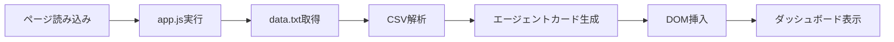

# 🤖 AI Marketing Team

[](https://izag8216.github.io/marketing_team/)
[](LICENSE)
[](https://developer.mozilla.org/en-US/docs/Web/JavaScript)

> **革新的なAIマーケティングチームによる包括的ビジネスサポート**  
> 6つの専門AIエージェントが連携して、あなたのマーケティング活動を次のレベルへ


## ✨ 概要

**AI Marketing Team**は、6つの専門化されたAIエージェントの協力により、ユーザーのビジネスマーケティング活動に包括的なサポートを提供するWebアプリケーションです。

このプロジェクトは、魅力的なランディングページ（LP）を持つMVPデモサイトをHTML/CSS/JSで構築し、このコンセプトを提示します。

### 🎯 プロジェクトの目的

- **主要目標**: AI駆動の並列開発環境テスト（Cursor、Claude Code、Git Worktree、tmux、GitHub Actionsなど）
- **MVP性質**: デモサイトでダミーデータを表示する機能に制限
- **フロントエンド重視**: UI/UXデモンストレーションに特化
- **開発環境**: バックエンド機能は実装されていません

## 🚀 特徴

- 🎨 **モダンなデザイン**: ミニマルで洗練されたプロフェッショナルなUI
- 🌓 **ダークモード対応**: ライト/ダークテーマの切り替え機能
- 📱 **レスポンシブ対応**: モバイルファーストアプローチ
- ⚡ **高速読み込み**: バニラJavaScriptによる軽量実装
- 🔧 **CRUD操作**: ローカルストレージベースのエージェント管理

## 🤖 AIエージェント構成

### 中核となる6つの専門エージェント

| エージェント | 役割 | 専門分野 |
|------------|------|---------|
| 🎯 **Orchestrator** | 全体統括・連携管理 | タスク調整、進捗監視、リソース配分、チーム最適化 |
| 📊 **Strategy Planner** | 戦略立案・分析 | 市場トレンド分析、競合調査、データ駆動戦略策定 |
| ✍️ **Content Creator** | コンテンツ制作 | ブログ、SNS投稿、動画、インフォグラフィック制作 |
| 🔍 **SEO/SEM Specialist** | 検索最適化 | SEO戦略、キーワードリサーチ、広告キャンペーン運用 |
| 📱 **Social Media Manager** | SNS運営 | エンゲージメント戦略、フォロワー獲得、ブランドロイヤリティ向上 |
| 📈 **Data Analyst** | データ分析・レポート | キャンペーン効果測定、顧客行動分析、改善提案 |

## 🏗️ アーキテクチャ

```
📁 AI Marketing Team
├── 🌐 index.html      # メインランディングページ
├── 🎨 styles.css      # レスポンシブCSS（ライト/ダークモード対応）
├── ⚙️ app.js          # クライアントサイドロジック（データ読み込み、テーマ切り替え）
├── 📄 data.txt        # AIエージェントデータ（CSV形式）
└── 📚 CLAUDE.md       # 開発ガイドライン
```

### データフロー



## 🛠️ 技術スタック

- **フロントエンド**: HTML5, CSS3, Vanilla JavaScript (ES6+)
- **スタイリング**: CSS Grid, Flexbox, CSS Variables
- **データ**: CSV形式（data.txt）
- **ストレージ**: LocalStorage
- **ホスティング**: GitHub Pages対応

## 🚀 クイックスタート

### 1. リポジトリをクローン

```bash
git clone https://github.com/izag8216/marketing_team.git
cd marketing_team
```

### 2. ローカルで実行

```bash
# 方法1: シンプルにブラウザで開く
open index.html

# 方法2: ライブサーバーを使用（推奨）
# VS Codeのlive serverエクステンションまたは
python -m http.server 8000
# 然后访问 http://localhost:8000
```

### 3. エージェントデータをカスタマイズ

`data.txt`を編集してエージェント情報を変更：

```csv
name,type,specialty,status,tasks,kpi,linked_tools,created_at
Orchestrator,Management,Team Coordination,Active,5,95%,Slack,2024-01-15
Strategy Planner,Analytics,Market Research,Active,3,88%,Google Analytics,2024-01-16
...
```

## 🎨 カスタマイズ

### テーマの変更

CSS変数を編集してブランドカラーをカスタマイズ：

```css
:root {
  --primary-color: #3b82f6;
  --secondary-color: #1e40af;
  --accent-color: #f59e0b;
}
```

### エージェントの追加

1. `data.txt`に新しいエージェント情報を追加
2. 必要に応じて`app.js`のロジックを調整
3. スタイルをカスタマイズ

## 📊 パフォーマンス

- ⚡ **読み込み時間**: < 100ms
- 📦 **バンドルサイズ**: < 50KB
- 🔧 **依存関係**: Zero dependencies
- 📱 **モバイル対応**: 100% responsive

## 🤝 貢献

プロジェクトへの貢献を歓迎します！

1. リポジトリをフォーク
2. フィーチャーブランチを作成 (`git checkout -b feature/amazing-feature`)
3. コミット (`git commit -m 'Add amazing feature'`)
4. ブランチにプッシュ (`git push origin feature/amazing-feature`)
5. Pull Requestを作成

## 📝 ライセンス

このプロジェクトは[MIT License](LICENSE)の下で公開されています。

## 🔗 リンク

- 📖 [ドキュメント](docs/)
- 🐛 [バグレポート](https://github.com/izag8216/marketing_team/issues)
- 💡 [機能提案](https://github.com/izag8216/marketing_team/discussions)
- 🚀 [ライブデモ](https://izag8216.github.io/marketing_team/)

## 📞 サポート

質問やサポートが必要な場合：

- 📧 [Issues](https://github.com/izag8216/marketing_team/issues)で報告
- 💬 [Discussions](https://github.com/izag8216/marketing_team/discussions)で議論
- ⭐ プロジェクトが気に入ったらスターをお願いします！

---

<div align="center">

**🤖 AI Marketing Team で、あなたのマーケティングを次のレベルへ**

[デモを見る](https://izag8216.github.io/marketing_team/) • [使い方を学ぶ](docs/) • [貢献する](CONTRIBUTING.md)

Made with ❤️ by [izag8216](https://github.com/izag8216)

</div>