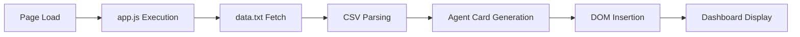

# 🤖 AI Marketing Team

[](https://izag8216.github.io/marketing_team/)
[](LICENSE)
[](https://developer.mozilla.org/en-US/docs/Web/JavaScript)

> **Comprehensive business support through innovative AI marketing team**  
> Six specialized AI agents collaborate to take your marketing activities to the next level


## ✨ Overview

**AI Marketing Team** is a web application that provides comprehensive support for users' business marketing activities through the collaboration of six specialized AI agents.

This project presents the concept by building an MVP demo site with an attractive landing page (LP) using HTML/CSS/JS.

### 🎯 Project Objectives

- **Primary Goal**: AI-driven parallel development environment testing (Cursor, Claude Code, Git Worktree, tmux, GitHub Actions, etc.)
- **MVP Nature**: Limited functionality to display dummy data on demo site
- **Frontend Focus**: Specialized in UI/UX demonstration
- **Development Environment**: Backend functionality is not implemented

## 🚀 Features

- 🎨 **Modern Design**: Minimal, sophisticated, and professional UI
- 🌓 **Dark Mode Support**: Light/dark theme toggle functionality
- 📱 **Responsive Design**: Mobile-first approach
- ⚡ **Fast Loading**: Lightweight implementation with vanilla JavaScript
- 🔧 **CRUD Operations**: Local storage-based agent management

## 🤖 AI Agent Configuration

### Six Core Specialized Agents

| Agent | Role | Expertise |
|-------|------|-----------|
| 🎯 **Orchestrator** | Overall coordination & collaboration management | Task coordination, progress monitoring, resource allocation, team optimization |
| 📊 **Strategy Planner** | Strategic planning & analysis | Market trend analysis, competitive research, data-driven strategy development |
| ✍️ **Content Creator** | Content production | Blog, social media posts, video, infographic creation |
| 🔍 **SEO/SEM Specialist** | Search optimization | SEO strategy, keyword research, advertising campaign management |
| 📱 **Social Media Manager** | Social media management | Engagement strategy, follower acquisition, brand loyalty improvement |
| 📈 **Data Analyst** | Data analysis & reporting | Campaign effectiveness measurement, customer behavior analysis, improvement proposals |

## 🏗️ Architecture

```
📁 AI Marketing Team
├── 🌐 index.html      # Main landing page
├── 🎨 styles.css      # Responsive CSS (light/dark mode support)
├── ⚙️ app.js          # Client-side logic (data loading, theme toggle)
├── 📄 data.txt        # AI agent data (CSV format)
└── 📚 CLAUDE.md       # Development guidelines
```

### Data Flow



## 🛠️ Tech Stack

- **Frontend**: HTML5, CSS3, Vanilla JavaScript (ES6+)
- **Styling**: CSS Grid, Flexbox, CSS Variables
- **Data**: CSV format (data.txt)
- **Storage**: LocalStorage
- **Hosting**: GitHub Pages compatible

## 🚀 Quick Start

### 1. Clone Repository

```bash
git clone https://github.com/izag8216/marketing_team.git
cd marketing_team
```

### 2. Run Locally

```bash
# Method 1: Simply open in browser
open index.html

# Method 2: Use live server (recommended)
# VS Code live server extension or
python -m http.server 8000
# Then visit http://localhost:8000
```

### 3. Customize Agent Data

Edit `data.txt` to modify agent information:

```csv
name,type,specialty,status,tasks,kpi,linked_tools,created_at
Orchestrator,Management,Team Coordination,Active,5,95%,Slack,2024-01-15
Strategy Planner,Analytics,Market Research,Active,3,88%,Google Analytics,2024-01-16
...
```

## 🎨 Customization

### Theme Modification

Edit CSS variables to customize brand colors:

```css
:root {
  --primary-color: #3b82f6;
  --secondary-color: #1e40af;
  --accent-color: #f59e0b;
}
```

### Adding Agents

1. Add new agent information to `data.txt`
2. Adjust `app.js` logic as needed
3. Customize styles

## 📊 Performance

- ⚡ **Load Time**: < 100ms
- 📦 **Bundle Size**: < 50KB
- 🔧 **Dependencies**: Zero dependencies
- 📱 **Mobile Support**: 100% responsive

## 🤝 Contributing

Contributions to the project are welcome!

1. Fork the repository
2. Create a feature branch (`git checkout -b feature/amazing-feature`)
3. Commit your changes (`git commit -m 'Add amazing feature'`)
4. Push to the branch (`git push origin feature/amazing-feature`)
5. Create a Pull Request

## 📝 License

This project is published under the [MIT License](LICENSE).

## 🔗 Links

- 📖 [Documentation](docs/)
- 🐛 [Bug Reports](https://github.com/izag8216/marketing_team/issues)
- 💡 [Feature Requests](https://github.com/izag8216/marketing_team/discussions)
- 🚀 [Live Demo](https://izag8216.github.io/marketing_team/)

## 📞 Support

For questions or support:

- 📧 Report via [Issues](https://github.com/izag8216/marketing_team/issues)
- 💬 Discuss via [Discussions](https://github.com/izag8216/marketing_team/discussions)
- ⭐ Please star the project if you like it!

---

<div align="center">

**🤖 Take your marketing to the next level with AI Marketing Team**

[View Demo](https://izag8216.github.io/marketing_team/) • [Learn Usage](docs/) • [Contribute](CONTRIBUTING.md)

Made with ❤️ by [izag8216](https://github.com/izag8216)

</div>